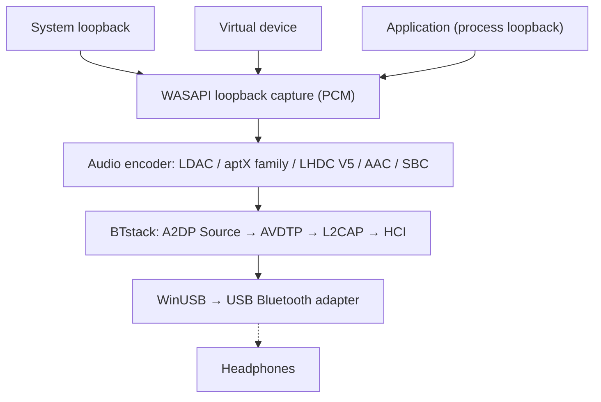

# A2DP Windows Bridge (A2DPWB)

Bluetooth A2DP audio streaming for Windows with full codec support.
{: .fs-6 .fw-300 }

Streams system audio via **LDAC, aptX HD, aptX Low Latency, aptX, AAC, SBC** and (experimental) **LHDC V5** using a USB Bluetooth adapter in WinUSB mode -- no kernel driver or test signing required.

[Get Started](setup){: .btn .btn-primary .fs-5 .mb-4 .mb-md-0 .mr-2 }
[GitHub](https://github.com/SeiyaFunaokaJP/A2DP-Windows-Bridge){: .btn .fs-5 .mb-4 .mb-md-0 }

---

## Supported Codecs

| Codec | Bitrate | Sample Rate | Bit Depth | Latency |
|:------|:--------|:------------|:----------|:--------|
| LDAC | 330/660/990 kbps | 44.1--96 kHz | 16/24/32 bit | ~200 ms |
| aptX HD | 576 kbps | 44.1/48 kHz | 24 bit | ~150 ms |
| aptX Low Latency | 352 kbps | 44.1/48 kHz | 16 bit | ~32 ms |
| aptX | 352/384 kbps | 44.1/48 kHz | 16 bit | -- |
| AAC | 128/192/256 kbps | 44.1/48 kHz | 16 bit | ~150 ms |
| SBC | up to ~345 kbps | 44.1/48 kHz | 16 bit | ~150 ms |
| LHDC V5 🧪 | 320/500/1000 kbps, ABR 160--400 kbps | 44.1/48/96/192 kHz | 16/24 bit | -- |

### Codec Support by Platform (Sending to Headphones)

| Codec | Windows 10 built-in | Windows 11 built-in | Ubuntu built-in (PipeWire) | **A2DPWB** (Windows 10 / 11) |
|:------|:-------------------:|:-------------------:|:--------------------------:|:----------------------------:|
| LDAC | ❌ | ❌ | ✅ | ✅ |
| aptX HD | ❌ | ❌ | ✅ | 🧪 experimental |
| aptX Low Latency | ❌ | ❌ | ✅ | 🧪 experimental |
| aptX | ✅ | ✅ | ✅ | ✅ |
| AAC | ❌ | ✅ | ❌ not in Ubuntu's packages | ✅ |
| SBC | ✅ | ✅ | ✅ | ✅ |
| LHDC V5 | ❌ | ❌ | ❌ | 🧪 experimental |
| aptX Adaptive | ❌ | ❌ | ❌ | ❌ |

✅ supported · 🧪 experimental · ❌ not supported. All columns are the sending side (PC → headphones). "Built-in" is the OS's own Bluetooth audio, without A2DPWB; the Ubuntu column is the PipeWire codec set of Ubuntu 26.04 (`libspa-0.2-bluetooth`).

{: .warning }
**aptX HD and aptX Low Latency are experimental.** They follow the Android / PipeWire implementations and pass encode/decode round-trip tests, but have not yet been verified with real headphones. Latency values in this table are typical figures, not measured with A2DPWB.

{: .warning }
**LHDC V5 is experimental.** It uses a C port of the LHDC V5 encoder that Google added to Android 17 (AOSP, Apache-2.0); the port was verified bit-exact against the AOSP Rust encoder, and the A2DP signaling follows Android's `a2dp_vendor_lhdcv5`. It has not yet been verified with real LHDC headphones. Only lossy LHDC V5 is supported: LHDC V2/V3 (older headphones) and the lossless "LHDC-RAW" mode have no open-source encoder. In Auto mode LHDC V5 ranks below LDAC and the aptX family and above AAC / SBC.

{: .note }
**Only need classic aptX?** Windows 10 already supports classic aptX in its built-in Bluetooth stack (not aptX HD, aptX LL or aptX Adaptive), so A2DPWB is not required for it. A2DPWB is mainly useful for LDAC, aptX HD and aptX Low Latency.

{: .note }
**aptX Adaptive is not supported** (there is no open-source encoder). If your headphones also list classic aptX, A2DPWB uses aptX directly; otherwise Auto picks AAC or SBC. See [aptX Family and aptX Adaptive Compatibility](usage#aptx-compatibility).

## Platform Support

| Component | Windows 10 (x64) | Windows 11 (x64) | Linux (Ubuntu) |
|:----------|:----------------:|:----------------:|:--------------:|
| **A2DPWB** (GUI / CLI) | ✅ (not yet tried on real hardware) | ✅ | ❌ |
| [Building from source](building) (Visual Studio 2022+) | ✅ | ✅ | ❌ |
| `a2dpwb_decode` (stream checker) | ✅ | ✅ | ❌ |
| End-to-end test `tools/emu/run_test.py` | ✅ | ✅ | ❌ |
| Virtual adapter `tools/emu/emu_vhci.py` | ❌ | ❌ | ✅ |
| [Measuring receiver](usage#receiver) `tools/linux_sink` | ❌ | ❌ | ✅ |

A2DPWB itself runs on Windows only, as an x64 build. The Linux tools need Python 3.11 or later (verified on Ubuntu 26.04); `setup.sh` targets Ubuntu / Debian, other distributions need the packages installed by hand.

## Verified Hardware

| What | Setup | Codecs | Result |
|:-----|:------|:-------|:-------|
| Sony WH-1000XM4 (headphones) | Windows 11 + TP-Link UB500 | LDAC, AAC, SBC | ✅ Plays (the XM4 has no aptX) |
| TP-Link UB500 (Realtek RTL8761BU, adapter) | Windows 11, WinUSB, linux-firmware `rtl8761bu` | – | ✅ |
| Measuring receiver `tools/linux_sink` | Windows 11 + UB500 → Ubuntu 26.04 over the air | SBC, AAC, aptX, aptX HD, aptX LL, LDAC | ✅ Received and measured |
| Virtual link `tools/emu` (Bumble) | Windows 11, no radio | SBC, AAC, aptX, aptX HD, aptX LL, LDAC, LHDC V5 | ✅ End-to-end test passes |

Windows 10 has not been tried on real hardware yet. Other adapters: see [Recommended Adapters](setup#adapters).

## Audio Capture Modes

A2DPWB captures audio via WASAPI and offers three modes:

| Mode | Description | Use Case |
|:-----|:------------|:---------|
| **System Loopback** | Captures all system audio output from the default playback device via WASAPI loopback | Simple setup -- all sounds are streamed |
| **Virtual Device** | Captures from a user-selected virtual audio device (e.g., VB-CABLE, VoiceMeeter) | Route specific apps to Bluetooth while keeping other audio on speakers |
| **Application** | Captures only what one app plays, after its own processing (Windows 11 / Windows 10 2004+) | Send one app, or the output of a system-wide effects app (equalizer, sound enhancer) |

In **Virtual Device** mode, A2DPWB switches the Windows default playback device to the selected virtual device, then captures its loopback output. Apps that output to the virtual device are streamed over Bluetooth. When streaming stops, the previous default device is restored.

System Loopback does not take the audio away from the default playback device: it plays there as well as over Bluetooth. See [Capture Modes](usage#capture-modes).

## How It Works

A2DPWB bypasses the Windows Bluetooth stack entirely. It communicates directly with a USB Bluetooth adapter through WinUSB, using [BTstack](https://github.com/bluekitchen/btstack) to implement the full Bluetooth protocol stack in user-mode.

## Features

- **Multi-codec**: LDAC, aptX HD, aptX Low Latency, aptX, AAC, SBC with automatic negotiation
- **Three capture modes**: System loopback, virtual audio device routing, or one application's output
- **ABR**: Adaptive Bit Rate for unstable connections (LDAC and LHDC V5)
- **Auto-reconnect**: Reconnects on disconnection (up to 10 attempts)
- **Link quality and AFH**: Shows what is sent, the RSSI and the channels in use; tells the adapter which Wi-Fi channels to avoid (see [Usage](usage#link-quality))
- **Headphone controls (AVRCP)**: Volume slider synced with the headphones and the Windows volume; their play/pause, next and previous buttons control playback on the PC (see [Usage](usage#headphone-buttons))
- **Profile management**: Save and load device + codec configurations
- **GUI + CLI**: wxWidgets graphical interface or command-line operation
- **Localization**: English / Japanese
- **Realtek firmware**: Guided firmware download for Realtek adapters
- **Diagnostics** (debug mode): debug console, HCI capture, peer receiver test against a Linux PC (see [Usage](usage#receiver))
