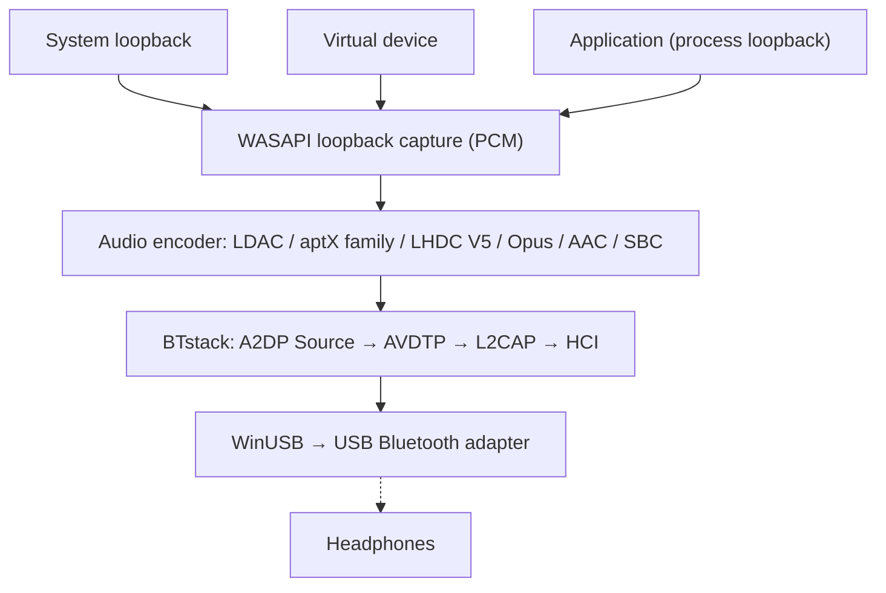

# A2DP Windows Bridge (A2DPWB)

Bluetooth A2DP audio streaming for Windows with full codec support.
{: .fs-6 .fw-300 }

Streams system audio via **LDAC, aptX HD, aptX Low Latency, aptX, AAC, SBC, LHDC V5** and (experimental) **Opus** and PipeWire's **Opus 05** using a USB Bluetooth adapter in WinUSB mode -- no kernel driver or test signing required.

[Get Started](setup){: .btn .btn-primary .fs-5 .mb-4 .mb-md-0 .mr-2 }
[GitHub](https://github.com/SeiyaFunaokaJP/A2DP-Windows-Bridge){: .btn .fs-5 .mb-4 .mb-md-0 }

---

## Supported Codecs

| Codec | Bitrate | Sample Rate | Bit Depth | Latency |
|:------|:--------|:------------|:----------|:--------|
| LDAC | 330/660/990 kbps | 44.1--96 kHz | 16/24/32 bit | ~200 ms |
| aptX HD 🧪 | 576 kbps | 44.1/48 kHz | 24 bit | ~150 ms |
| aptX Low Latency 🧪 | 352 kbps | 44.1/48 kHz | 16 bit | ~32 ms |
| aptX | 352/384 kbps | 44.1/48 kHz | 16 bit | -- |
| AAC | 128/192/256 kbps | 44.1/48 kHz | 16 bit | ~150 ms |
| SBC XQ | ~385/505/552 kbps | 44.1/48 kHz | 16 bit | ~150 ms |
| SBC | up to ~345 kbps | 44.1/48 kHz | 16 bit | ~150 ms |
| FastStream 🧪 | 198/216 kbps | 44.1/48 kHz | 16 bit | -- |
| LHDC V5 | 400/500/900/1000 kbps, ABR 160--400 kbps | 44.1/48/96/192 kHz | 16/24 bit | -- |
| Opus 🧪 | 128/192/256 kbps | 48 kHz | 16 bit | -- |
| Opus 05 🧪 | 128/192/256 kbps | 48 kHz | 16 bit | -- |

### Codec Support by Platform (Sending to Headphones)

| Codec | Windows 10 built-in | Windows 11 built-in | Ubuntu built-in (PipeWire) | **A2DPWB** (Windows 10 / 11) |
|:------|:-------------------:|:-------------------:|:--------------------------:|:----------------------------:|
| LDAC | ❌ | ❌ | ✅ | ✅ |
| aptX HD | ❌ | ❌ | ✅ | 🧪 experimental |
| aptX Low Latency | ❌ | ❌ | ✅ | 🧪 experimental |
| aptX | ✅ | ✅ | ✅ | ✅ |
| AAC | ❌ | ✅ | ❌ not in Ubuntu's packages | ✅ |
| SBC XQ | ❌ | ❌ | ✅ | ✅ (sinks whose SBC allows dual channel, bitpool ≥ 43) |
| SBC | ✅ | ✅ | ✅ | ✅ |
| FastStream | ❌ | ❌ | ✅ | 🧪 experimental (music only, chosen explicitly) |
| LHDC V5 | ❌ | ❌ | ❌ | ✅ |
| Opus (Android's A2DP Opus) | ❌ | ❌ | ✅ PipeWire 1.2+ (`opus_g`); not in Ubuntu 24.04 (PipeWire 1.0.5) | 🧪 experimental |
| Opus 05 (PipeWire's own Opus) | ❌ | ❌ | ✅ PipeWire 0.3.57+ (`opus_05`, to PipeWire devices only) | 🧪 experimental (chosen explicitly) |
| aptX Adaptive | ❌ | ❌ | ❌ | ❌ |

✅ supported · 🧪 experimental · ❌ not supported. All columns are the sending side (PC → headphones). "Built-in" is the OS's own Bluetooth audio, without A2DPWB; the Ubuntu column is the PipeWire codec set of Ubuntu 26.04 (`libspa-0.2-bluetooth`).

{: .warning }
**aptX HD and aptX Low Latency are experimental.** They follow the Android / PipeWire implementations and pass encode/decode round-trip tests, but have not yet been verified with real headphones. Latency values in this table are typical figures, not measured with A2DPWB.

{: .warning }
**About LHDC V5.** It uses a C port of the LHDC V5 encoder that Google added to Android 17 (AOSP, Apache-2.0); the port was verified bit-exact against the AOSP Rust encoder, and the A2DP signaling follows Android's `a2dp_vendor_lhdcv5`. A user verified it with real LHDC V5 headphones at 1000 kbps / 192 kHz on v1.1.1-beta.1 ([#50](https://github.com/SeiyaFunaokaJP/A2DP-Windows-Bridge/issues/50)); v2 uses the same encoder. Only lossy LHDC V5 is supported: LHDC V2/V3 (older headphones) and the lossless "LHDC-RAW" mode have no open-source encoder. In Auto mode LHDC V5 ranks below LDAC and the aptX family and above AAC / SBC.

{: .warning }
**Opus is experimental.** It is Android's A2DP Opus vendor codec (Android 13+, vendor ID 0x000000E0 Google): 48 kHz, 20 ms frames, 256 kbps stereo as Android requests it (Standard 192, Mobile 128 kbps), encoded with libopus 1.5.2. It passes the end-to-end test against a virtual sink, but has not yet been verified with real Opus headphones. In Auto mode it ranks below LHDC V5 and above AAC / SBC.

{: .warning }
**Opus 05 is experimental and unverified.** It is PipeWire's own A2DP Opus vendor codec (vendor ID 0x000005F1, codec 0x1005; PipeWire `opus_05`), which only PipeWire implements, so the receiver has to be a PC running PipeWire as an A2DP sink. A2DPWB sends the stereo music direction only (no 5.1 / 7.1, no return channel): 48 kHz, 10 ms frames (20 ms if the sink has only that), the same libopus encoder and bit rates as Opus, capped at the sink's limit. Auto never picks it; choose it in the profile or with `-c opus05`. It passes the end-to-end test against a virtual sink that offers PipeWire's capabilities, but has not been tried with a real PipeWire receiver. PipeWire as an A2DP sink decodes Opus 05 since 0.3.57 and Android's Opus (`opus_g`) since 1.2.0: Ubuntu 24.04 LTS ships PipeWire 1.0.5 (Opus 05 only), Ubuntu 25.10 (1.4.7) and 26.04 LTS (1.6.2) ship both; neither is verified with A2DPWB yet.

{: .warning }
**SBC XQ** was verified with a Sony WH-1000XM4 (dual channel, bitpool 43 at 48 kHz, 552 kbps). Sinks that refuse the configuration are reconnected with plain SBC. **FastStream is experimental:** it passes the end-to-end test against a virtual sink but has not been tried with real FastStream headphones. Music direction only; Auto never picks it.

{: .note }
**Only need classic aptX?** Windows 10 already supports classic aptX in its built-in Bluetooth stack (not aptX HD, aptX LL or aptX Adaptive), so A2DPWB is not required for it. A2DPWB is mainly useful for LDAC, aptX HD and aptX Low Latency.

{: .note }
**aptX Adaptive is not supported** (there is no open-source encoder). If your headphones also list classic aptX, A2DPWB uses aptX directly; otherwise Auto picks AAC or SBC. See [aptX Family and aptX Adaptive Compatibility](usage#aptx-compatibility).

## Platform Support

| Component | Windows 10 (x64 / ARM64) | Windows 11 (x64 / ARM64) | Linux (Ubuntu) |
|:----------|:----------------:|:----------------:|:--------------:|
| **A2DPWB** (window, tray, CLI) | ✅ (not yet tried on real hardware) | ✅ | ❌ |
| [Building from source](building) (Rust, Visual Studio 2022+, Node.js) | ✅ | ✅ | ❌ |
| `a2dpwb_decode` (stream checker) | ✅ | ✅ | ❌ |
| End-to-end test `tools/emu/run_test.py` | ✅ | ✅ | ❌ |
| Virtual adapter `tools/emu/emu_vhci.py` | ❌ | ❌ | ✅ |
| [Measuring receiver](usage#receiver) `tools/linux_sink` | ❌ | ❌ | ✅ |

A2DPWB itself runs on Windows only (Windows 10 22H2 or Windows 11), built for x64 and ARM64. The Linux tools need Python 3.11 or later (verified on Ubuntu 26.04); `setup.sh` targets Ubuntu / Debian, other distributions need the packages installed by hand.

## Verified Hardware

| What | Setup | Codecs | Result |
|:-----|:------|:-------|:-------|
| Sony WH-1000XM4 (headphones) | Windows 11 + TP-Link UB500 | LDAC, AAC, SBC, SBC XQ | ✅ Plays (the XM4 has no aptX) |
| TP-Link UB500 (Realtek RTL8761BU, adapter) | Windows 11, WinUSB, linux-firmware `rtl8761bu` | – | ✅ |
| Measuring receiver `tools/linux_sink` | Windows 11 + UB500 → Ubuntu 26.04 over the air | SBC, AAC, aptX, aptX HD, aptX LL, LDAC | ✅ Received and measured |
| Virtual link `tools/emu` (Bumble) | Windows 11, no radio | SBC, SBC XQ, AAC, aptX, aptX HD, aptX LL, LDAC, LHDC V5, FastStream, Opus, Opus 05 | ✅ End-to-end test passes |

Windows 10 has not been tried on real hardware yet. Other adapters: see [Recommended Adapters](setup#adapters).

## Dropouts and Connection Problems

What the dropout and connection reports turned out to be, the checks to run before reporting, and how to read Link Quality: **[Dropouts and Connection Problems](wireless)**.

## Audio Capture Modes

A2DPWB captures audio via WASAPI and offers three modes:

| Mode | Description | Use Case |
|:-----|:------------|:---------|
| **System Loopback** | Captures all system audio output from the default playback device via WASAPI loopback | Simple setup -- all sounds are streamed |
| **Virtual Device** | Captures from a user-selected virtual audio device (e.g., VB-CABLE, VoiceMeeter) | Route specific apps to Bluetooth while keeping other audio on speakers |
| **Application** | Captures only what one app plays, after its own processing (Windows 11 / Windows 10 2004+) | Send one app, or the output of a system-wide effects app (equalizer, sound enhancer) |

In **Virtual Device** mode, A2DPWB can switch the Windows default playback device to the selected virtual device (**Auto-switch default device**), then captures its loopback output. Apps that output to the virtual device are streamed over Bluetooth. When streaming stops, the previous default device is restored.

System Loopback does not take the audio away from the default playback device: it plays there as well as over Bluetooth. See [Capture Modes](usage#capture-modes).

## How It Works

```mermaid
---
config:
  flowchart:
    wrappingWidth: 480
    rankSpacing: 30
---
flowchart TD
    s1["System loopback"]
    s2["Virtual device"]
    s3["Application (process loopback)"]
    s1 & s2 & s3 --> cap["WASAPI loopback capture (PCM)"]
    cap --> enc["Audio encoder: LDAC / aptX family / LHDC V5 / Opus / AAC / SBC"]
    enc --> bt["BTstack: A2DP Source → AVDTP → L2CAP → HCI"]
    bt --> usb["WinUSB → USB Bluetooth adapter"]
    usb -.-> hp["Headphones"]
```

A2DPWB bypasses the Windows Bluetooth stack entirely. It communicates directly with a USB Bluetooth adapter through WinUSB, using [BTstack](https://github.com/bluekitchen/btstack) to implement the full Bluetooth protocol stack in user-mode. A small resident program (`a2dpwb-core.exe`, with the tray icon) streams the audio; the window only shows its state, so closing it does not stop the audio (see [Architecture](architecture)).

## Features

- **Multi-codec**: LDAC, aptX HD, aptX Low Latency, aptX, AAC, SBC, LHDC V5 and (experimental) Opus / Opus 05 with automatic negotiation
- **LE Audio (experimental)**: LC3 to LE Audio headphones and earbuds (BAP unicast, both earbuds of a pair, headset volume, media buttons, GMAP low latency). Needs an adapter with Bluetooth 5.2 isochronous channels; tested only against the Bluetooth emulator, not yet with real LE Audio headphones ([Usage](usage#le-audio))
- **Three capture modes**: System loopback, virtual audio device routing, or one application's output
- **Window, tray and CLI**: a window for setup and diagnostics, a tray flyout and menu for everyday connecting, and a command line (see [Usage](usage))
- **WinUSB in the app**: assigns the WinUSB driver to the adapter and restores the original driver, no Zadig needed (see [Setup](setup#winusb))
- **First-run setup**: adapter, driver and firmware, headphones, a first connection
- **ABR**: Adaptive Bit Rate for unstable connections (LDAC and LHDC V5)
- **Auto-reconnect**: Reconnects on disconnection (up to 10 attempts), and after the PC resumes from sleep
- **Link quality and AFH**: Shows what is sent, the RSSI and the channels in use; tells the adapter which Wi-Fi channels to avoid (see [Usage](usage#link-quality))
- **Headphone controls (AVRCP)**: Volume slider synced with the headphones and the Windows volume; their play/pause, next and previous buttons control playback on the PC (see [Usage](usage#headphone-buttons))
- **Profile management**: Device + codec + capture configurations, connectable from the tray
- **Updates**: The installed version updates itself after streaming stops (see [Usage](usage#updates))
- **Localization**: English, Japanese, Simplified / Traditional Chinese, Korean, German, French and Spanish
- **Realtek firmware**: Guided firmware download for Realtek adapters
- **Diagnostics**: connection flow, log, HCI capture, diagnostics for bug reports, peer receiver test against a Linux PC (see [Usage](usage#receiver))
